# Crawford County CBM Data Acquisition

Coal resource data for coalbed methane (CBM) assessment in Crawford County, Illinois and surrounding counties.

## Overview

This repository contains drill hole data and analysis scripts for evaluating CBM potential in a 6-county study area in southeastern Illinois. The data supports a pre-drilling assessment before committing to a $920K drilling program.

**Study Area Counties**: Crawford, Clark, Lawrence, Jasper, Cumberland, Richland

## Visualizations

### Interactive Maps

Explore drill hole locations and coal seam data with interactive HTML maps:

| Map | Description |
|-----|-------------|
| [All Seams Combined](https://pyrex41.github.io/coalgas/visualizations/interactive/all-seams-map.html) | Overview of all coal seams |
| [Herrin Coal](https://pyrex41.github.io/coalgas/visualizations/interactive/herrin-map.html) | Herrin (No. 6) Coal drill holes |
| [Springfield Coal](https://pyrex41.github.io/coalgas/visualizations/interactive/springfield-map.html) | Springfield (No. 5) Coal drill holes |
| [Danville Coal](https://pyrex41.github.io/coalgas/visualizations/interactive/danville-map.html) | Danville (No. 7) Coal drill holes |
| [Colchester Coal](https://pyrex41.github.io/coalgas/visualizations/interactive/colchester-map.html) | Colchester (No. 2) Coal drill holes |
| [Seelyville Coal](https://pyrex41.github.io/coalgas/visualizations/interactive/seelyville-map.html) | Seelyville Coal drill holes |

### Static Plots

| Seam | Thickness Map | Depth Map | Histogram |
|------|---------------|-----------|-----------|
| Herrin | 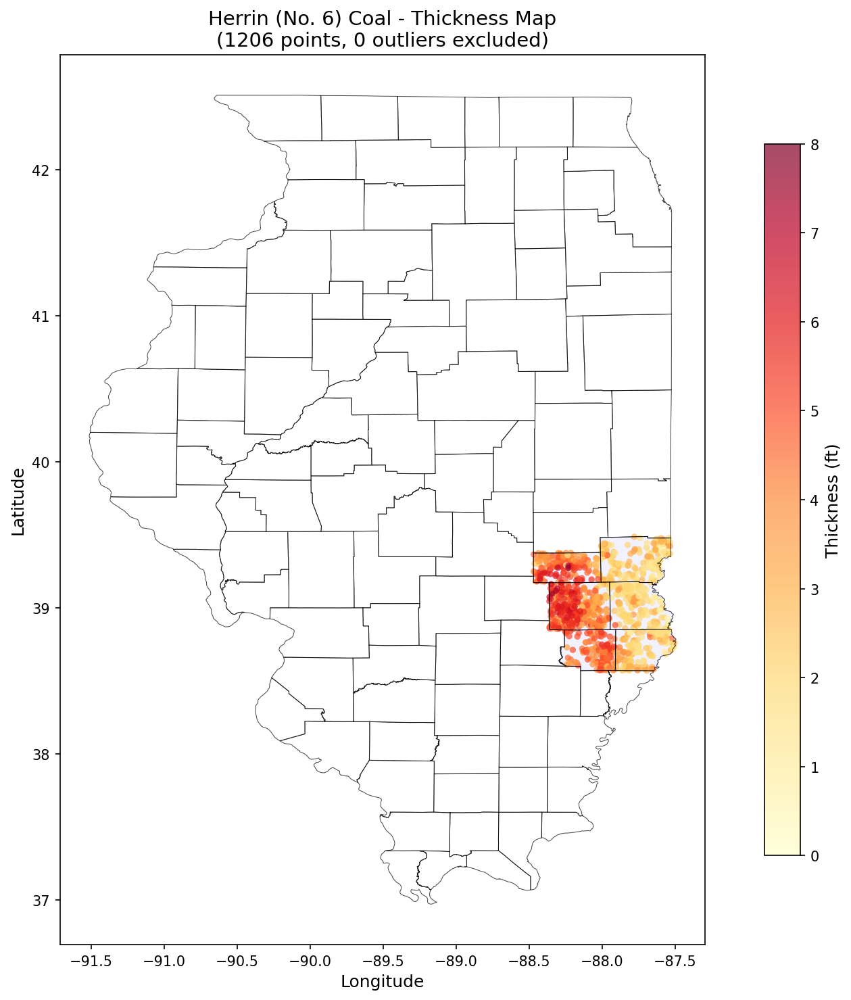 | 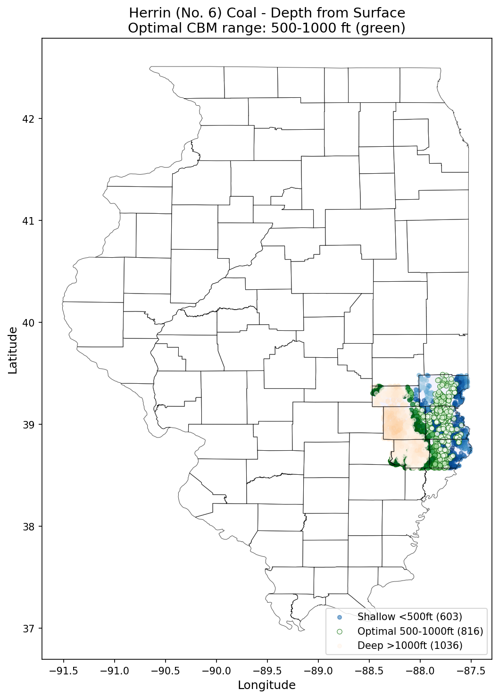 | 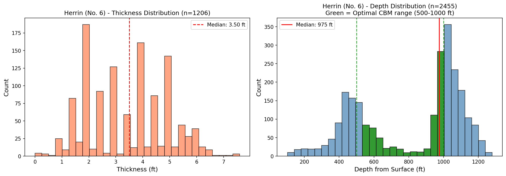 |
| Springfield | 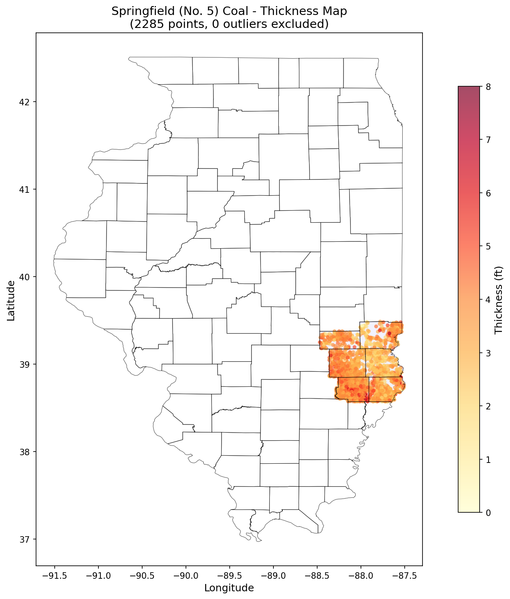 | 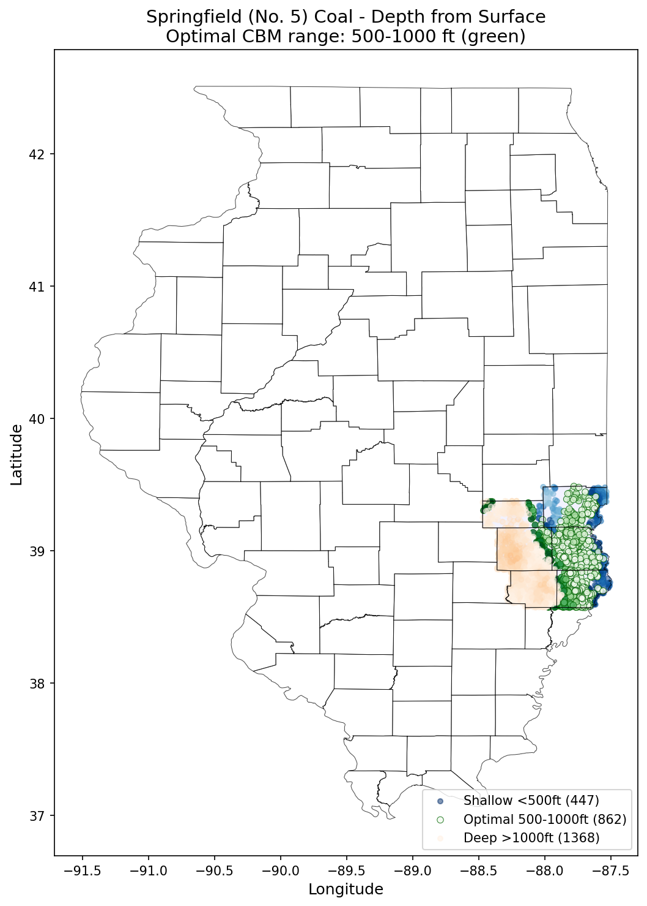 | 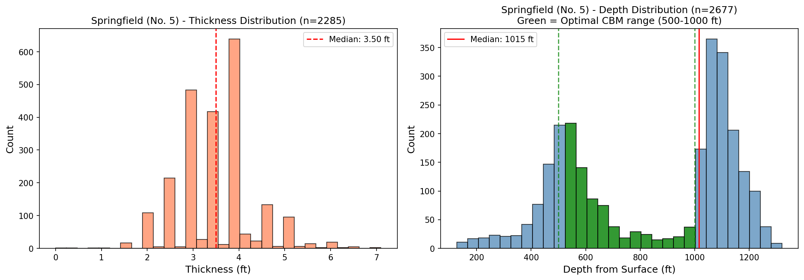 |
| Danville | 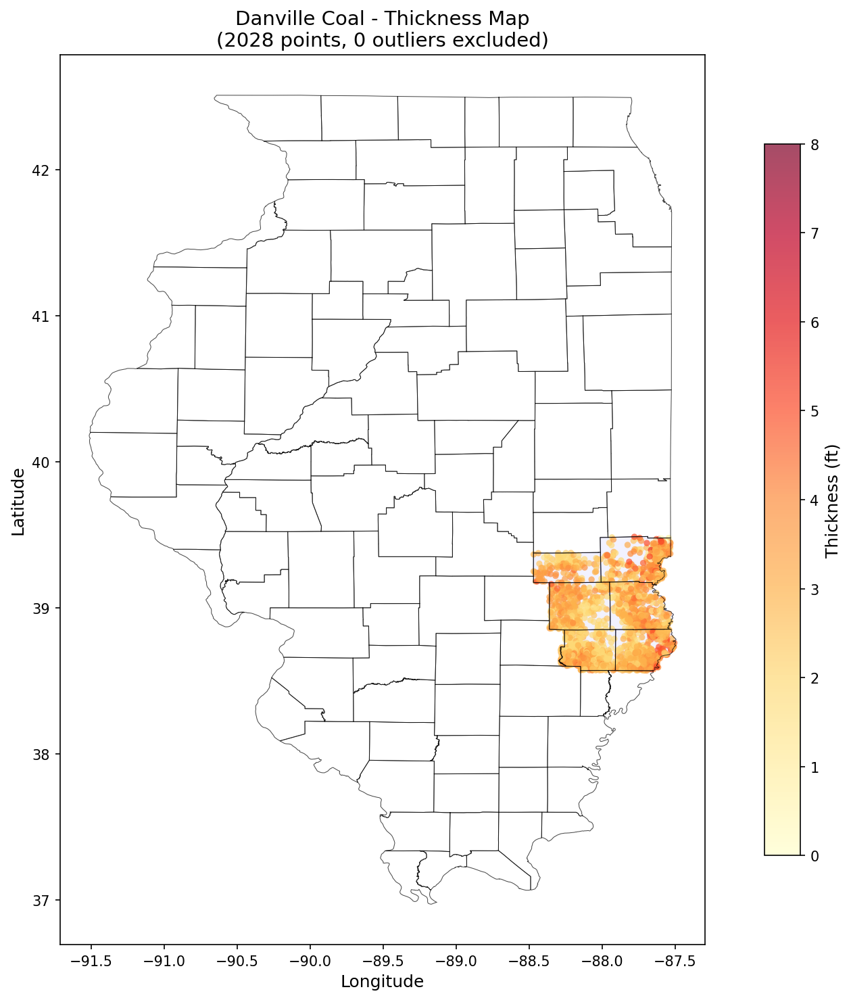 | 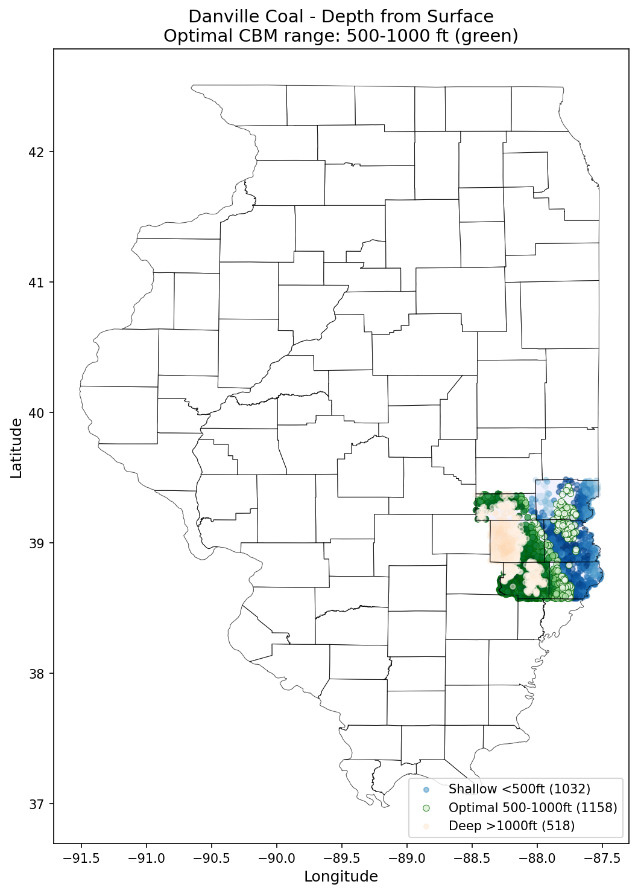 | 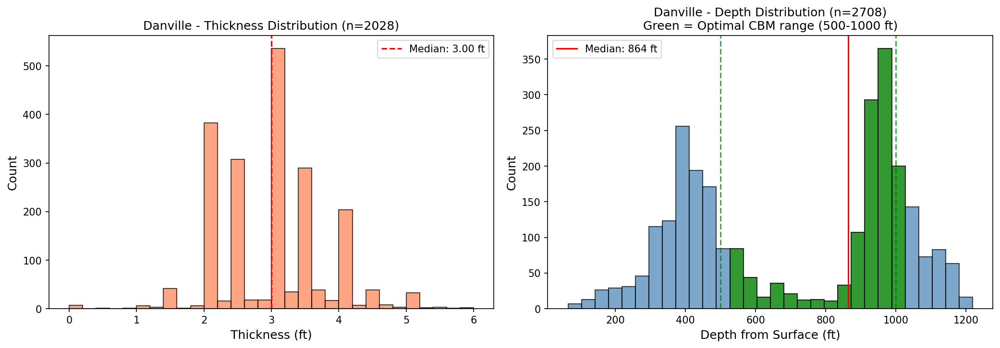 |
| Colchester | 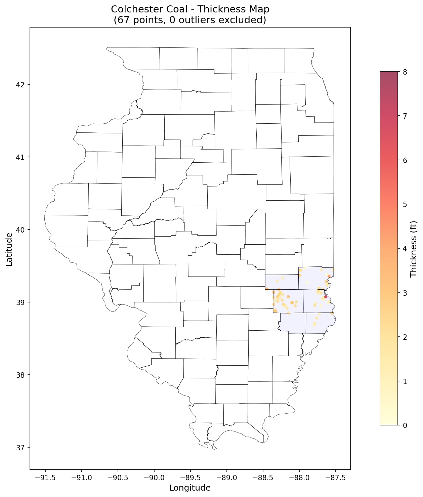 | 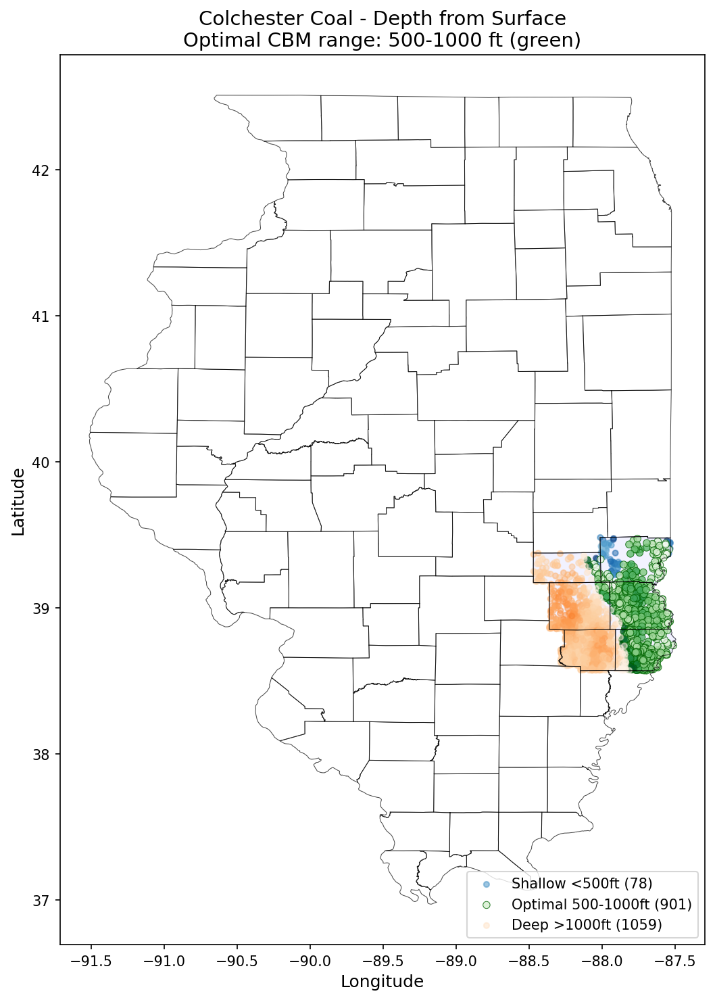 | 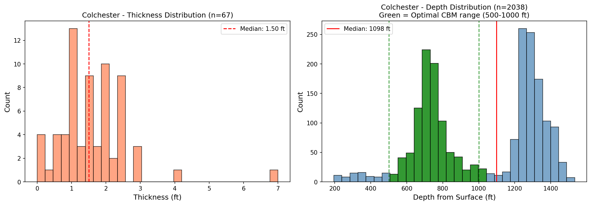 |
| Seelyville | 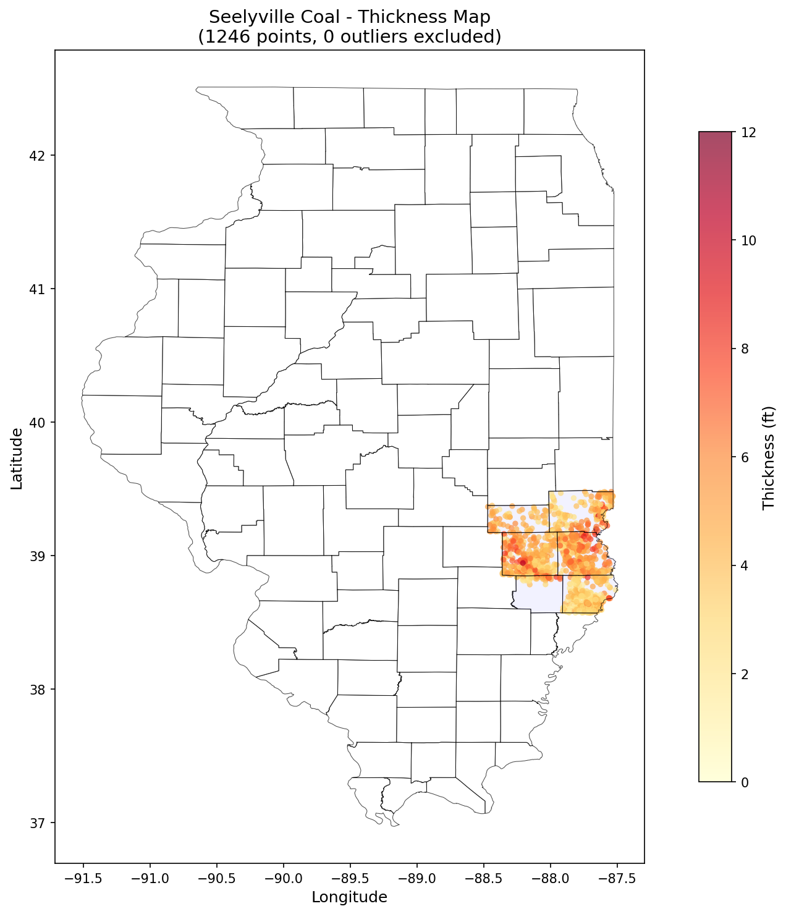 |  | 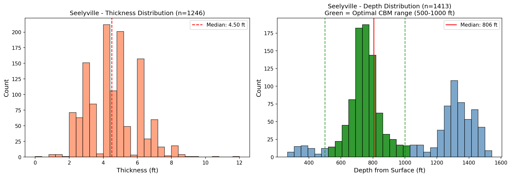 |

To regenerate visualizations:
```bash
python visualize_coal_data.py
```

## Quick Start

```bash
# Generate summary statistics
python3 summarize_coal_data.py

# Filter datasets to study area (already done)
python3 filter_study_area.py
```

## Data Summary

| Dataset | Records | Coverage |
|---------|---------|----------|
| Major Coals (statewide) | 58,463 | Danville, Herrin, Springfield |
| Major Coals (study area) | 2,854 | 6-county filtered |
| Minor Coals (statewide) | 12,604 | Colchester, Seelyville, etc. |
| Minor Coals (study area) | 2,419 | 6-county filtered |
| **Crawford County** | **826** | 414 major + 412 minor |

## Key Findings

- **Best CBM Target**: Springfield Coal - 78% of Crawford County records in optimal 500-1000 ft depth range
- **Herrin Coal (No. 6)**: Primary target, thickest seam with best data coverage
- **Data Gap**: No direct gas content measurements exist - core sampling required

## Repository Structure

```
coalgas/
├── README.md                    # This file
├── DATA_SOURCES.md              # Complete data acquisition guide
├── filter_study_area.py         # Script to filter data to 6 counties
├── summarize_coal_data.py       # Generate summary statistics
├── visualize_coal_data.py       # Generate maps and plots
├── examples/                    # Sample data files (50 rows each)
├── visualizations/
│   ├── interactive/             # Interactive HTML maps (Folium)
│   └── static/                  # PNG plots (thickness, depth, histograms)
├── data/
│   ├── csv/                     # Processed CSV files (68 MB)
│   └── downloads/               # Source data files (132 MB)
└── thoughts/shared/
    ├── plans/                   # Implementation plan
    └── handoffs/                # Handoff documentation
```

## CSV Data Files

### Primary Analysis Files

| File | Records | Description |
|------|---------|-------------|
| [`all-coals-study-area-combined.csv`](data/csv/all-coals-study-area-combined.csv) | 2,854 | **Main analysis file** - merged major/minor coal data |
| [`major-coals-all-study-area.csv`](data/csv/major-coals-all-study-area.csv) | 2,854 | Danville, Herrin, Springfield for 6 counties |
| [`minor-coals-all-study-area.csv`](data/csv/minor-coals-all-study-area.csv) | 2,419 | Colchester, Seelyville for 6 counties |

### Statewide Source Files

| File | Records | Description |
|------|---------|-------------|
| [`major-coals-all.csv`](data/csv/major-coals-all.csv) | 58,463 | All Illinois major coal drill holes |
| [`minor-coals-all.csv`](data/csv/minor-coals-all.csv) | 12,604 | All Illinois minor coal drill holes |

### Shapefile-Derived Data (Polygon Contours)

| File | Records | Content |
|------|---------|---------|
| [`herrin-depth.csv`](data/csv/herrin-depth.csv) | 3,904 | Herrin Coal depth contours |
| [`herrin-thickness.csv`](data/csv/herrin-thickness.csv) | 853 | Herrin Coal thickness contours |
| [`springfield-depth.csv`](data/csv/springfield-depth.csv) | 3,089 | Springfield Coal depth contours |
| [`springfield-thickness.csv`](data/csv/springfield-thickness.csv) | 702 | Springfield Coal thickness contours |
| [`danville-depth.csv`](data/csv/danville-depth.csv) | 112 | Danville Coal depth contours |
| [`danville-thickness.csv`](data/csv/danville-thickness.csv) | 416 | Danville Coal thickness contours |
| [`colchester-depth.csv`](data/csv/colchester-depth.csv) | 261 | Colchester Coal depth contours |
| [`colchester-thickness.csv`](data/csv/colchester-thickness.csv) | 302 | Colchester Coal thickness contours |
| [`seelyville-depth.csv`](data/csv/seelyville-depth.csv) | 50 | Seelyville Coal depth contours |
| [`seelyville-thickness.csv`](data/csv/seelyville-thickness.csv) | 69 | Seelyville Coal thickness contours |

## CSV Column Reference

### Major/Minor Coals Drill Hole Data

```
IDS           - Unique drill hole identifier
COUNTY_NAME   - County name (CRAWFORD, CLARK, etc.)
LONGITUDE     - WGS84 longitude (decimal degrees)
LATITUDE      - WGS84 latitude (decimal degrees)
SURFELV       - Surface elevation (ft above sea level)
WELL_TYPE     - Well classification
LOG_TYPE      - Type of log data available

# Major coals (Danville, Herrin, Springfield)
TOP_DANVILLE, THICK_DANVILLE   - Danville Coal elevation & thickness
TOP_HERRIN, THICK_HERRIN       - Herrin Coal elevation & thickness
TOP_SPRING, THICK_SPRING       - Springfield Coal elevation & thickness

# Minor coals (in minor-coals files)
TOP_COLCH, THICK_COLCH         - Colchester Coal elevation & thickness
TOP_SEELY, THICK_SEELY         - Seelyville Coal elevation & thickness
```

**Note**: `TOP_*` values are elevations (ft above sea level), not depths from surface. Calculate actual depth: `SURFELV - TOP_*`

## Scripts

### [`filter_study_area.py`](filter_study_area.py)

Filters statewide drill hole data to the 6-county study area.

- Uses county name filtering (primary) or bounding box fallback
- Outputs `*-study-area.csv` files
- Uses only Python stdlib (`csv` module) - no pandas required

### [`summarize_coal_data.py`](summarize_coal_data.py)

Generates summary statistics for CBM assessment.

- Calculates depth/thickness ranges per seam
- Shows Crawford County-specific statistics
- Creates combined CSV merging major and minor coal data
- Outputs CBM potential assessment summary

## Documentation

| Document | Description |
|----------|-------------|
| [`2025-01-04-crawford-county-cbm-data-acquisition.md`](thoughts/shared/plans/2025-01-04-crawford-county-cbm-data-acquisition.md) | Full implementation plan with verification steps |
| [`2025-01-04-cbm-data-acquisition-handoff.md`](thoughts/shared/handoffs/2025-01-04-cbm-data-acquisition-handoff.md) | Handoff notes and context |

## Example Data

The [`examples/`](examples/) directory contains sample files (50 rows each) for quick inspection:

| File | Description |
|------|-------------|
| [`major-coals-sample.csv`](examples/major-coals-sample.csv) | Sample major coals drill hole data |
| [`minor-coals-sample.csv`](examples/minor-coals-sample.csv) | Sample minor coals drill hole data |
| [`herrin-depth-sample.csv`](examples/herrin-depth-sample.csv) | Sample Herrin Coal depth contours |

## Data Sources

See [`DATA_SOURCES.md`](DATA_SOURCES.md) for complete download instructions and data documentation.

**Quick Links**:
- **ILMINES Wiki**: https://ilmineswiki.web.illinois.edu/
- **Major Coals Dataset**: [58,000+ drill holes](https://wikiimage.isgs.illinois.edu/ilmines/webfiles/shapefiles/majorcoals-stratdata-ascii.zip)
- **Minor Coals Dataset**: [12,000+ drill holes](https://wikiimage.isgs.illinois.edu/ilmines/webfiles/shapefiles/minorcoals-stratdata-ascii.zip)
- **Coal Shapefiles**: [Illinois Coal Resource Shapefiles](https://ilmineswiki.web.illinois.edu/wiki/Illinois_Coal_Resource_Shapefiles)

## Excluded from Git

Large binary files are excluded via `.gitignore`:

- `data/downloads/*.zip` - Downloaded ZIP archives (132 MB)
- `data/shapefiles/` - Extracted shapefile data (176 MB)
- `data/reference-pdfs/` - PDF maps for visual reference

To regenerate these files, follow the download instructions in the [implementation plan](thoughts/shared/plans/2025-01-04-crawford-county-cbm-data-acquisition.md).

## CBM Assessment Notes

### Optimal Depth Range

For coalbed methane, the "sweet spot" is typically 500-1000 ft from surface:
- Too shallow (<500 ft): Insufficient pressure to hold methane
- Too deep (>1000 ft): Reduced permeability, higher drilling costs

### Critical Data Gap

**No direct gas content measurements exist for Crawford County.** This cannot be resolved through public data - core sampling is required as Phase 1 of the drilling program.

### Contact

ISGS Coal Section: ilmines@isgs.illinois.edu, 217-244-2414

## License

Data sourced from public Illinois State Geological Survey resources.
